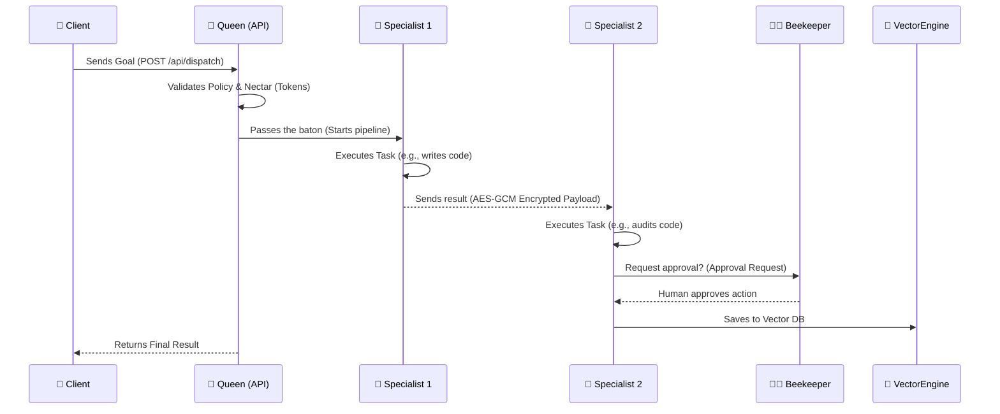
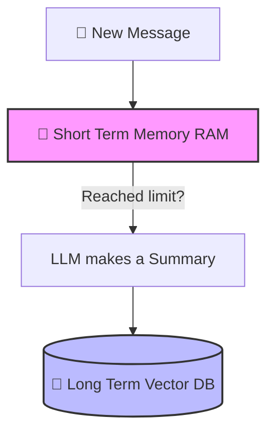
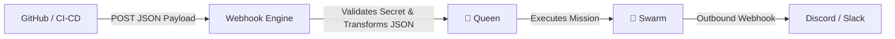

# 🐝 Jandaira Swarm OS

<p align="center">
  
</p>

A simple and powerful **autonomous multi-agent** framework written in Go. Inspired by the native Brazilian bee **Jandaíra**, it allows you to create "hives" of AIs that work together safely and efficiently.

> **English** · [Português](../README.md) · [Español](README.es.md) · [中文](README.zh.md) · [Русский](README.ru.md)

---

## 🚀 Setup and Installation (Start Here!)

Running Jandaira is incredibly easy! The system comes with its own embedded vector database, so you **don't need Docker** to run the API.

### 1. Prerequisites
* [Go](https://go.dev/) (version 1.22 or higher) installed.
* An OpenAI API key (or compatible).


### 2. Choose How to Install

**Option A: Automatic Installation (Linux/macOS - Easiest)**
Downloads and configures everything for you automatically.
```bash
curl -fsSL https://github.com/damiaoterto/jandaira/releases/latest/download/install.sh | sudo bash
```
*Frontend Dashboard: `http://localhost:9000` | API: `http://localhost:8080`*

**Option B: Via Docker (Full Stack)**
Ideal if you want the Backend + Frontend running together without installing dependencies on your host.
```bash
docker pull ghcr.io/damiaoterto/jandaira:latest
docker run -d -p 8080:8080/tcp -p 9000:9000/tcp ghcr.io/damiaoterto/jandaira:latest
```

**Option C: Build from Source**
For those who want to modify or contribute to the project.
```bash
git clone https://github.com/damiaoterto/jandaira.git
cd jandaira
go mod tidy
go run ./cmd/api/main.go --port 8080
```

**Option D: Windows Installation**
Download the installer from the [releases page](https://github.com/damiaoterto/jandaira/releases/latest) and run it as Administrator in PowerShell:
```powershell
powershell.exe -ExecutionPolicy Bypass -File .\install-windows.ps1
```

### 3. Testing Your Hive
After starting the server (it will be running on port 8080), you can send a goal to the AI:

```bash
curl -X POST http://localhost:8080/api/dispatch \
  -H "Content-Type: application/json" \
  -d '{"goal": "Create a Go file named sum.go that adds two numbers", "group_id": "alpha-swarm"}'
```
You can monitor what the AI is doing in real-time via WebSocket: `ws://localhost:8080/ws`.

---

## ⚖️ Licensing (Explained Simply)

**Jandaira Swarm OS** uses a dual-license model to be fair to the community and businesses.

1. **For the Community (100% Free - AGPLv3):**
   You can download, use, modify, and distribute Jandaira for free. 
   ⚠️ **The Rule:** If you use Jandaira to build a product, project, or web service, **you must make the source code of your project open and public** for everyone.

2. **For Businesses (Commercial License):**
   Do you want to use Jandaira in your company or build a closed-source product, but **don't want** to share your system's source code? 
   ✅ **The Solution:** We sell a **Commercial License**. With it, you can use Jandaira in private projects without the obligation to open your code. Contact us!

---

## 📖 What is Jandaira?

Inspired by the Brazilian bee that works together without needing a central leader, our system divides work among multiple "AI agents":

- **Queen (`Queen`):** Does not execute tasks. She only organizes, manages the "nectar" (token budget), and ensures security.
- **Specialists (`Specialists`):** The worker bees. Each agent has a specific role (e.g., developer, auditor) and limited tools to perform their job.
- **Beekeeper (You!):** The human-in-the-loop. The AI can ask for your approval before taking dangerous actions.

---

## 🏗️ How the Architecture Works

### The Main Flow



### How Memory Works (Short & Long Term)

To avoid spending too many tokens and to keep the AI smart over time, we split memory into two layers:



### Knowledge Graph (AI Learning by Itself)

The Queen learns from past missions! If an agent did well at "analyzing sales," she will call upon them again in the future.

```mermaid
graph LR
    O[Goal: "Analyze Sales"] --> R{Queen checks Graph}
    R -->|Finds Profile| A1((Sales Analyst))
    A1 -->|Expert in| T[Topic: "sales data"]
    R -->|Builds team based on experience| E[Final Swarm]
```

---

## 🪝 Webhook Engine (Easy Integrations)

You can connect Jandaira to GitHub, Slack, etc. The AI is automatically triggered when an event occurs.



---

## ⚡ Why choose Go over Python?

| Feature                     | NanoClaw (Python)         | Jandaira (Go) 🏆                       |
| --------------------------- | ------------------------- | -------------------------------------- |
| **Performance**             | Heavy, requires threads   | Super lightweight with native Goroutines|
| **Installation**            | Requires dependencies/Docker| A single executable binary!            |
| **Agent Security**          | Non-existent              | Native AES-GCM encryption              |
| **AI Database**             | Requires external services| Vector Database (HNSW) built-in!       |
| **Human Approval**          | External workarounds      | Native via real-time WebSocket         |

---

## 🌐 API Quick Reference

| Action | HTTP Route | Description |
| --- | --- | --- |
| **Dispatch Mission** | `POST /api/dispatch` | Sends a job to the hive. |
| **List Tools** | `GET /api/tools` | See what the AIs can do. |
| **Real-time** | `GET /ws` | WebSocket to monitor AIs and approve actions. |
| **Webhooks** | `POST /api/webhooks/:slug` | Triggers an external event. |

---

## 🤝 Contributing

Pull Requests are very welcome! Please open an issue describing what you want to improve before you start coding.

_Jandaira: Autonomy, Security, and the Power of the Brazilian Swarm._ 🐝
