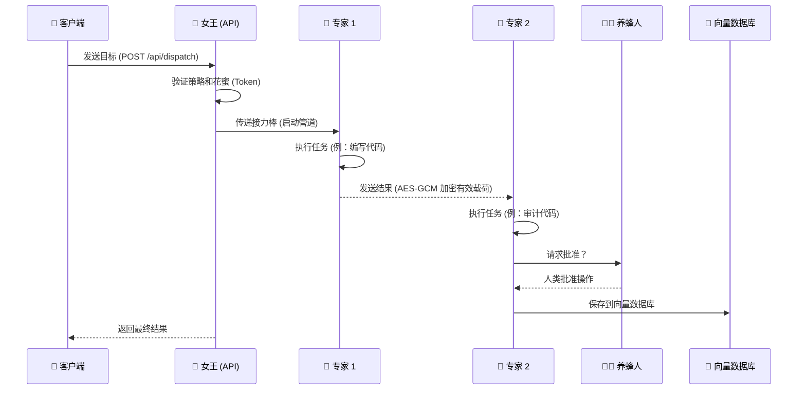
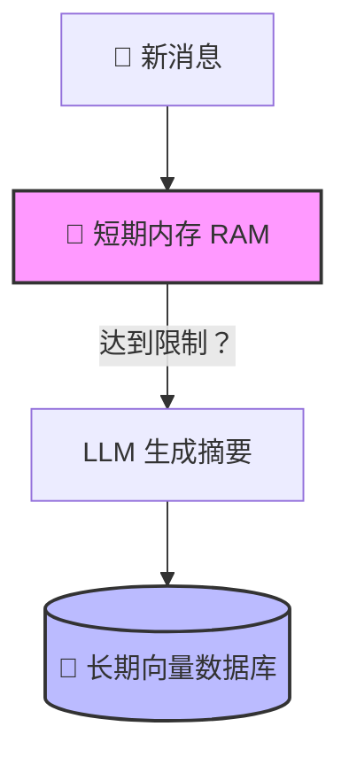
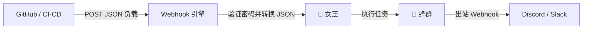

# 🐝 Jandaira Swarm OS

<p align="center">
  
</p>

一个用 Go 编写的简单而强大的**自主多智能体**框架。受巴西本土蜜蜂 **Jandaíra** 的启发，它允许您创建安全高效地协同工作的 AI “蜂巢”。

> [English](README.en.md) · [Português](../README.md) · [Español](README.es.md) · **中文** · [Русский](README.ru.md)

---

## 🚀 安装与设置（从这里开始！）

运行 Jandaira 非常容易！系统自带嵌入式向量数据库，因此如果您只运行 API，**不需要 Docker**。

### 1. 先决条件
* 安装 [Go](https://go.dev/) (1.22 或更高版本)。
* 一个 OpenAI API 密钥 (或兼容的密钥)。


### 2. 选择安装方式

**选项 A：自动安装（Linux/macOS - 最简单）**
自动为您下载并配置一切。
```bash
curl -fsSL https://github.com/damiaoterto/jandaira/releases/latest/download/install.sh | sudo bash
```
*前端面板：`http://localhost:9000` | API：`http://localhost:8080`*

**选项 B：通过 Docker（全栈）**
如果您希望 Backend + Frontend 一起运行，而不在电脑上安装任何依赖项，这是理想选择。
```bash
docker pull ghcr.io/damiaoterto/jandaira:latest
docker run -d -p 8080:8080/tcp -p 9000:9000/tcp ghcr.io/damiaoterto/jandaira:latest
```

**选项 C：从源码编译**
适合想要修改或为项目做贡献的人。
```bash
git clone https://github.com/damiaoterto/jandaira.git
cd jandaira
go mod tidy
go run ./cmd/api/main.go --port 8080
```

**选项 D：Windows 安装**
从 [Releases 页面](https://github.com/damiaoterto/jandaira/releases/latest) 下载安装程序并在 PowerShell 中以管理员身份运行它：
```powershell
powershell.exe -ExecutionPolicy Bypass -File .\install-windows.ps1
```

### 3. 测试您的蜂巢
启动服务器后（它将在 8080 端口上运行），您可以向 AI 发送目标：

```bash
curl -X POST http://localhost:8080/api/dispatch \
  -H "Content-Type: application/json" \
  -d '{"goal": "创建一个名为 sum.go 的 Go 文件，计算两个数字的和", "group_id": "alpha-swarm"}'
```
您可以通过 WebSocket 实时监控 AI 正在做什么：`ws://localhost:8080/ws`。

---

## ⚖️ 许可说明（通俗易懂）

**Jandaira Swarm OS** 采用双重许可模型，以确保对社区和企业公平。

1. **面向社区（100% 免费 - AGPLv3）：**
   您可以免费下载、使用、修改和分发 Jandaira。
   ⚠️ **规则：** 如果您使用 Jandaira 创建产品、项目或 Web 服务，**您必须将项目的源代码公开**。

2. **面向企业（商业许可）：**
   您是否想在公司使用 Jandaira，或者创建闭源产品，但**不想**分享您系统的源代码？
   ✅ **解决方案：** 我们销售**商业许可**。拥有它，您可以在私人项目中使用 Jandaira，而无需公开您的代码。联系我们！

---

## 📖 什么是 Jandaira？

受巴西本土蜜蜂无需中央领导即可协同工作的启发，我们的系统将工作分配给多个“AI 智能体”：

- **女王 (`Queen`)：** 不执行任务。她只负责组织、管理“花蜜”（代币预算），并确保安全。
- **专家 (`Specialists`)：** 工作蜂。每个智能体都有特定的角色（例如，开发人员、审计员）和有限的工具来执行其工作。
- **养蜂人（您！）：** 闭环中的人类。AI 在执行危险操作之前可能会请求您的批准。

---

## 🏗️ 架构如何工作

### 主要流程



### 内存如何工作（短期和长期）

为了避免消耗太多代币并使 AI 随时间推移保持智能，我们将内存分为两层：



### 知识图谱（AI 自我学习）

女王从过去的任务中学习！如果一个智能体在“分析销售数据”方面做得很好，她将来会再次召唤它。

```mermaid
graph LR
    O[目标: "分析销售"] --> R{女王检查图谱}
    R -->|找到档案| A1((销售分析师))
    A1 -->|专家| T[主题: "销售数据"]
    R -->|根据经验组建团队| E[最终蜂群]
```

---

## 🪝 Webhook 引擎（轻松集成）

您可以将 Jandaira 连接到 GitHub、Slack 等。当事件发生时，AI 会自动触发。



---

## ⚡ 为什么选择 Go 而不是 Python？

| 比较                        | NanoClaw (Python)         | Jandaira (Go) 🏆                       |
| --------------------------- | ------------------------- | -------------------------------------- |
| **性能**                    | 沉重，需要线程            | 使用原生 Goroutines 非常轻量           |
| **安装**                    | 需要依赖项/Docker         | 一个可执行文件！                       |
| **智能体之间的安全**        | 不存在                    | 原生 AES-GCM 加密                      |
| **AI 数据库**               | 需要外部服务              | 内置向量数据库 (HNSW)！                |
| **人类批准**                | 外部补丁                  | 原生通过 WebSocket 实时进行            |

---

## 🌐 API 快速参考

| 操作 | HTTP 路由 | 描述 |
| --- | --- | --- |
| **分配任务** | `POST /api/dispatch` | 向蜂巢发送工作。 |
| **列出工具** | `GET /api/tools` | 查看 AI 能做什么。 |
| **实时监控** | `GET /ws` | WebSocket，用于监控 AI 并批准操作。 |
| **Webhooks** | `POST /api/webhooks/:slug` | 触发外部事件。 |

---

## 🤝 贡献

非常欢迎 Pull Request！在开始编码之前，请打开一个 issue 描述您想要改进的内容。

_Jandaira：自主、安全与巴西蜂群的力量。_ 🐝
